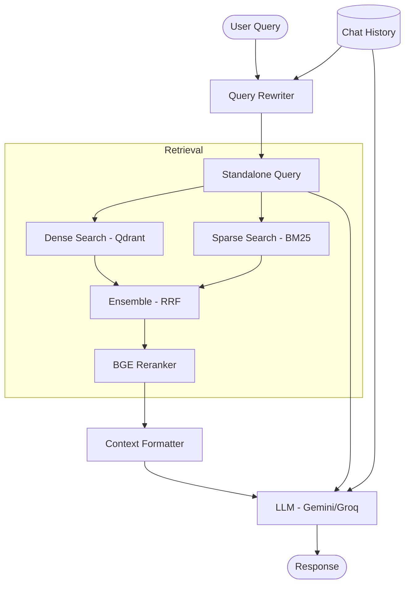

# RAG Workflow - Spicy Noodle Chatbot

This document describes the end-to-end workflow of the Retrieval-Augmented Generation (RAG) system for the Spicy Noodle Chatbot.

## 1. Data Ingestion & Indexing

The ingestion process transforms relational data from PostgreSQL into searchable documents in Qdrant.

### Workflow:
1.  **Loader**: Fetches product data (names, categories, prices, toppings, reviews) from the PostgreSQL database.
2.  **Builder (`ProductDocumentBuilder`)**:
    *   Constructs a rich text representation of each product.
    *   Includes metadata (ID, category, price, rating) for filtering and identification.
    *   Optimizes text with descriptive labels (e.g., "Tên món ăn:", "Cấp độ cay:") to improve semantic search relevance.
3.  **Indexer**:
    *   Generates dense embeddings using the **BGE-M3** model.
    *   Upserts documents and embeddings into the **Qdrant** vector store.

---

## 2. Retrieval Pipeline

The retrieval pipeline uses a multi-stage approach to ensure high precision and recall.

### Step 1: Query Rewriting
*   The raw user query is passed through a **Query Rewriting Chain**.
*   It uses the conversation history to contextualize the query into a standalone search term.
*   It standardizes product names and identifies intent (e.g., searching for reviews vs. searching for prices).

### Step 2: Hybrid Search (RRF)
We use an `EnsembleRetriever` combining two types of searches:
1.  **Dense Retrieval (Vector Search)**:
    *   Uses Qdrant to find semantically similar documents based on BGE-M3 embeddings.
    *   Good for finding products by description or intent (e.g., "món nào cay nhất").
2.  **Sparse Retrieval (BM25)**:
    *   Uses keyword matching.
    *   Excellent for exact product names or specific toppings (e.g., "Lẩu Tomyum").

**Reciprocal Rank Fusion (RRF)**: Combines results from both retrievers using weights (default: 60% Dense, 40% Sparse).

### Step 3: Reranking
*   The top candidates (e.g., 10 documents) from Hybrid Search are passed to a **Cross-Encoder Reranker** (`bge-reranker-v2-m3`).
*   The reranker evaluates the direct relevance between the query and each document text.
*   Results are re-sorted, and only the top `k` (e.g., 5) documents are passed to the LLM.

---

## 3. Response Generation

The final stage generates the answer for the user.

### Workflow:
1.  **Context Preparation**: The retrieved documents are formatted into a structured string. Each document is labeled with its source (e.g., "Sản phẩm: Mì Cay").
2.  **QA Prompt**:
    *   The LLM receives the system prompt, chat history, the formatted context, and the rewritten query.
    *   The prompt instructs the LLM to **only use the provided context** and avoid hallucinations.
3.  **Generation**:
    *   The LLM (Gemini 1.5 Flash or Llama-3.3-70B via Groq) generates a friendly, accurate response.
    *   Supports **Streaming** for a better user experience.

---

## 4. Architecture Diagram

## 5. Performance Tuning

*   **Weights**: Adjust `RETRIEVAL_DENSE_WEIGHT` and `RETRIEVAL_SPARSE_WEIGHT` in `.env` to balance between semantic and keyword search.
*   **Top K**: Controlled via `RETRIEVAL_HYBRID_TOP_K` and `RETRIEVAL_RERANK_TOP_K`.
*   **Prompting**: The system prompt is optimized to handle Vietnamese culinary terms and specific restaurant business rules.
